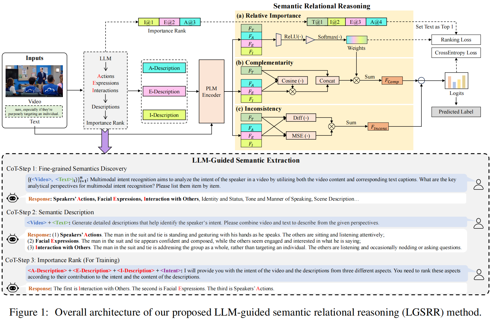
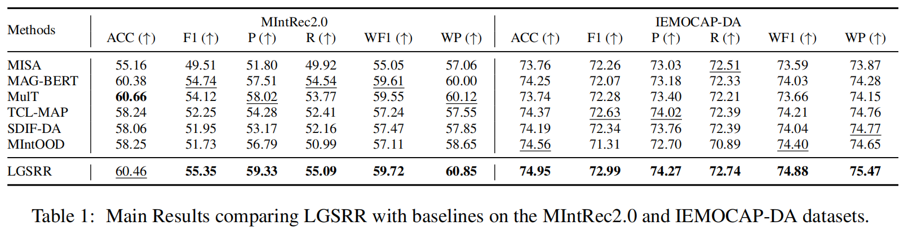

# LLM-Guided Semantic Relational Reasoning for Multimodal Intent Recognition

This repository provides the official PyTorch implementation of the research paper:

 [LLM-Guided Semantic Relational Reasoning for Multimodal Intent Recognition](https://arxiv.org/abs/2509.01337) (**Accepted by [EMNLP2025 Main Track]**). 

## 1.Introduction

Understanding human intents from multimodal signals is critical for analyzing human behaviors and enhancing human-machine interactions in real-world scenarios. However, existing methods exhibit limitations in their modality-level reliance, constraining relational reasoning over fine-grained semantics for complex intent understanding. This paper proposes a novel LGSRR method, which harnesses the expansive knowledge of LLMs to establish semantic foundations that boost smaller models' relational reasoning performance.

## 2. Dependencies 

We use anaconda to create python environment and install required libraries:

```
cd LGSRR
conda create --name lgsrr python=3.9
conda activate lgsrr
conda install pytorch==1.13.1 torchvision==0.14.1 torchaudio==0.13.1 pytorch-cuda=11.7 -c pytorch -c nvidia
pip install -r requirements.txt
```

## 3. Usage

The data can be downloaded through the following links:

```
https://drive.google.com/drive/folders/1nCkhkz72F6ucseB73XVbqCaDG-pjhpSS
```

You can evaluate the performance of our proposed LGSRR on [MIntRec2.0](https://proceedings.iclr.cc/paper_files/paper/2024/file/ca97c1a8c52889c49e16497912244c3b-Paper-Conference.pdf) and [IEMOCAP-DA](https://aclanthology.org/2020.acl-main.402.pdf) by using the following commands:

- MIntRec2.0

```
sh examples/run_lgsrr_MIntRec2.sh
```

- IEMOCAP-DA

```
sh examples/run_lgsrr_IEMOCAP-DA.sh
```

You are required to configure the path to the pre-trained model in the `configs/__init__.py` file.

## 4. Model

The overview model architecture:




## 5. Experimental Results



## 6. Citation

If you are insterested in this work, and want to use the codes or results in this repository, please **star** this repository and **cite** by:

```
@misc{zhou2025llmguidedsemanticrelationalreasoning,
      title={LLM-Guided Semantic Relational Reasoning for Multimodal Intent Recognition}, 
      author={Qianrui Zhou and Hua Xu and Yifan Wang and Xinzhi Dong and Hanlei Zhang},
      year={2025},
      eprint={2509.01337},
      archivePrefix={arXiv},
      primaryClass={cs.MM},
      url={https://arxiv.org/abs/2509.01337}, 
}
```

## 7. Acknowledgments

Some of the codes in this repo are adapted from [MIntRec](https://github.com/thuiar/MIntRec/tree/main), and we are greatly thankful.

If you have any questions, please open issues and illustrate your problems as detailed as possible.


